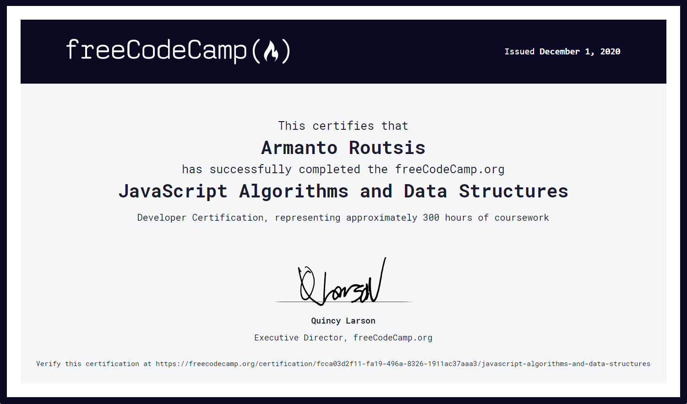

<h1 align="center">JavaScript Algorithms and Data Structures
</h1>

<h1 align="center">
  
</h1>

* #### Project I - [Palindrome Checker](https://github.com/ArmantoArisRoutsis/FreeCodeCamp/tree/main/JavaScript-Algorithms-and-Data-Structures/Project-01__Palindrome-Checker)
* #### Project II - [Roman Numeral Converte](https://github.com/ArmantoArisRoutsis/FreeCodeCamp/tree/main/JavaScript-Algorithms-and-Data-Structures/Project-02__Roman-Numeral-Converter)
* #### Project III - [Caesars Cipher](https://github.com/ArmantoArisRoutsis/FreeCodeCamp/tree/main/JavaScript-Algorithms-and-Data-Structures/Project-03__Caesars-Cipher)
* #### Project VI - [Telephone Number Validator](https://github.com/ArmantoArisRoutsis/FreeCodeCamp/tree/main/JavaScript-Algorithms-and-Data-Structures/Project-04__Telephone-Number-Validator)
* #### Project V - [Cash Register](https://github.com/ArmantoArisRoutsis/FreeCodeCamp/tree/main/JavaScript-Algorithms-and-Data-Structures/Project-05__Cash-Register)