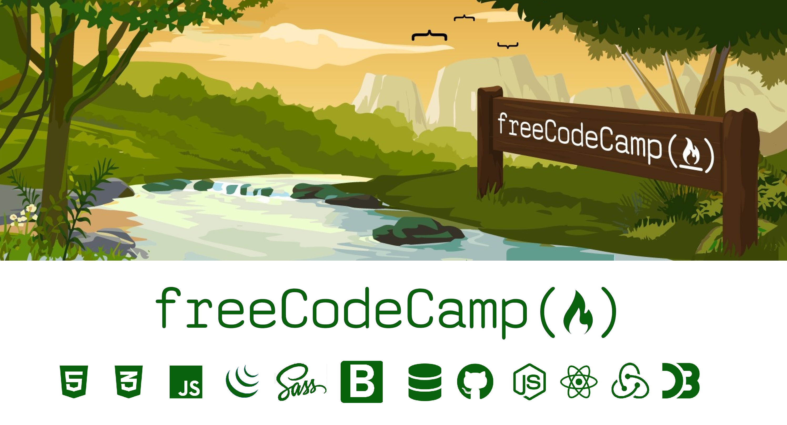

<h1 align="center">
  
</h1>

##### The FreeCodeCamp is a Web Development course that focuses on FullStack Web Development. Its curriculum is full of projects that help build a strong portfolio of work on Github to fill a resume.

## Curriculum
### [Responsive Web Design](https://github.com/ArmantoArisRoutsis/FreeCodeCamp/tree/main/Responsive-Web-Design)
* #### Project I - [Tribute Page](https://github.com/ArmantoArisRoutsis/FreeCodeCamp/tree/main/Responsive-Web-Design/Project_01-Tribute_Page)
* #### Project II - [Survey Form](https://github.com/ArmantoArisRoutsis/FreeCodeCamp/tree/main/Responsive-Web-Design/Project_02-Survey_Form)
* #### Project III - [Product Landing Page](https://github.com/ArmantoArisRoutsis/THE-ODIN-PROJECT/tree/master/FOUNDATIONS)
* #### Project VI - [Technical Documentation Page](https://github.com/ArmantoArisRoutsis/THE-ODIN-PROJECT/tree/master/FOUNDATIONS)
* #### Project V - [Personal Portofolio Webpage](https://github.com/ArmantoArisRoutsis/FreeCodeCamp/tree/main/Responsive-Web-Design/Project_05-Personal_Portofolio_Webpage)